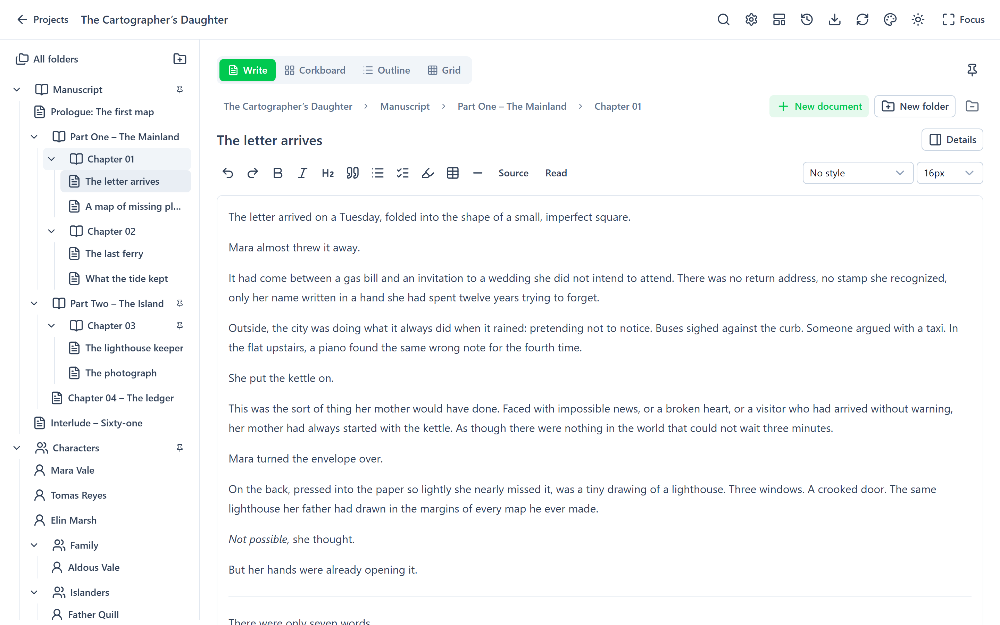
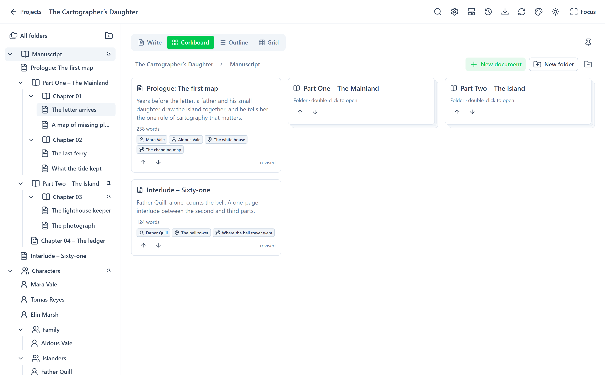
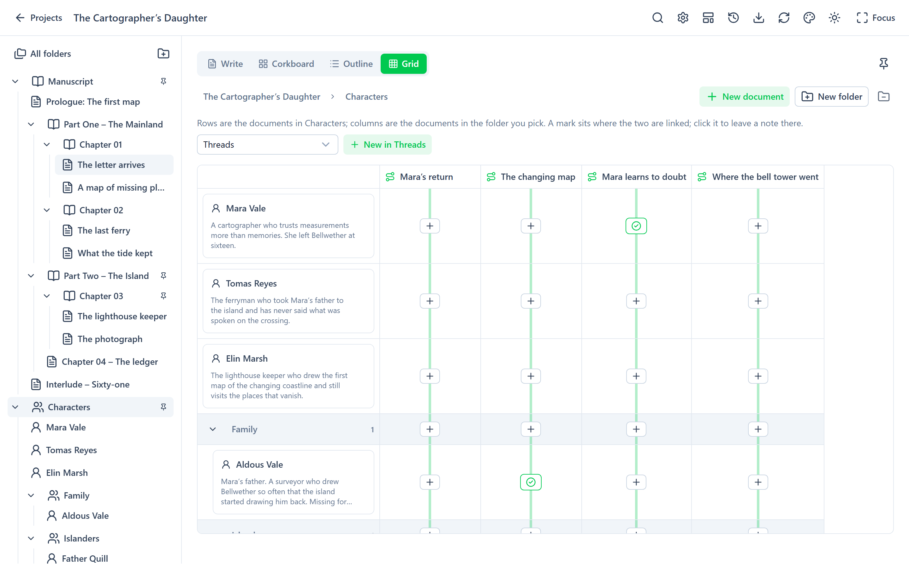

<p align="center">
  
</p>

<h1 align="center">Odysseum</h1>

<p align="center">Self-hosted writing software for novels and books.</p>

<p align="center">
  <a href="LICENSE"></a>
  
  <a href="https://github.com/odysseumapp/odysseum/actions/workflows/desktop.yml"></a>
</p>

<picture>
  <source media="(prefers-color-scheme: dark)" srcset="docs/images/screenshot-dark.png">
  
</picture>

> [!NOTE]
> Odysseum is in early development and breaking changes will be shipped regularly.

## Planned features

- Multiple projects in one workspace
- Corkboard and outline
- Markdown editing
- Source Mode/Reading Mode/Focus Mode
- Word goals
- Offline support
- Exports
- And more

There is a demo manuscript included when `ODYSSEUM_DEMO=true`.

## Views

**Corkboard**: each scene as a card, with its synopsis, word count and links.

<picture>
  <source media="(prefers-color-scheme: dark)" srcset="docs/images/corkboard-dark.png">
  
</picture>

**Grid**: link any two folders, such as Characters against Threads, and leave a note where they meet.

<picture>
  <source media="(prefers-color-scheme: dark)" srcset="docs/images/grid-dark.png">
  
</picture>

## Run with Docker

```sh
docker compose up --build -d
```

Open **http://localhost:5080**. The container uses two directories:

| Container path | Host default |  |
|---|---|---|
| `/projects` | `./projects` | your projects |
| `/data` | `./data` | `server-settings.json`, authentication keys |

Set `ODYSSEUM_DEMO` to `false` to start with an empty workspace. [docs/compose.example.yaml](docs/compose.example.yaml) runs the published image instead of building from source.

To access Odysseum remotely, a reverse proxy is recommended. Configure `ODYSSEUM_PASSWORD` in a `.env` file.

## Run locally on Windows

Requires the .NET 10 SDK and a checkout of [odysseum-web](https://github.com/odysseumapp/odysseum-web) beside this one (or pass `-WebRoot`). The build script downloads a local Node.js if a suitable one is not installed.

```powershell
./scripts/build.ps1
./scripts/start.ps1
```

Open **http://localhost:5080**. To open a different directory:

```powershell
./scripts/start.ps1 -Workspace 'D:\Writing\My Novel'
```

## Workspace and project format

Projects are plain folders of Markdown files. See [docs/project-format.md](docs/project-format.md) for the details.

```text
workspace/                      ← ODYSSEUM_WORKSPACE
  The Cartographer's Daughter/  ← one project per folder
    Manuscript/
      Chapter 01/
        The letter arrives.md
        .odysseum/folder.json
    Characters/
      Mara Vale.md
    .odysseum/
      project.json
      links.json
      instance.lock
    .git/                       ← versions and document history
  Short stories/
```

## Configuration

| Variable | Default | Purpose |
|---|---|---|
| `ODYSSEUM_WORKSPACE` | `workspace` beside the repository's server directory (`/projects` in Docker) | Root directory holding one folder per project |
| `ODYSSEUM_DEMO` | `true` in development, otherwise `false` | Seed an empty workspace with the sample project |
| `ODYSSEUM_PASSWORD` | unset | Optional password for the single workspace |
| `ODYSSEUM_SCAN_SECONDS` | `3` | Full reconciliation interval, 1–300 seconds |
| `ODYSSEUM_KEYS` | ASP.NET Core default (`/data/keys` in Docker) | Persistent authentication key directory |
| `ODYSSEUM_SETTINGS` | `server-settings.json` beside the server (`/data/server-settings.json` in Docker) | Optional settings file |
| `ODYSSEUM_THEMES` | `themes` beside the settings file | Saved colour schemes, one JSON file per theme |
| `ODYSSEUM_TEMPLATES` | `templates` beside the settings file | Project templates, one JSON file per template |

## API

Odysseum's API is described at **http://localhost:5080/scalar**.

## AI usage

AI coding tools are used in the development of Odysseum. The developer is a programmer by trade and all code is reviewed before merging. Odysseum is a hobby project and will be worked on as spare time allows.

## Contributing

See [CONTRIBUTING.md](CONTRIBUTING.md).

## License

[GNU AGPL v3](LICENSE)
